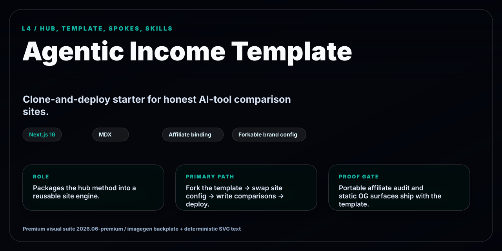
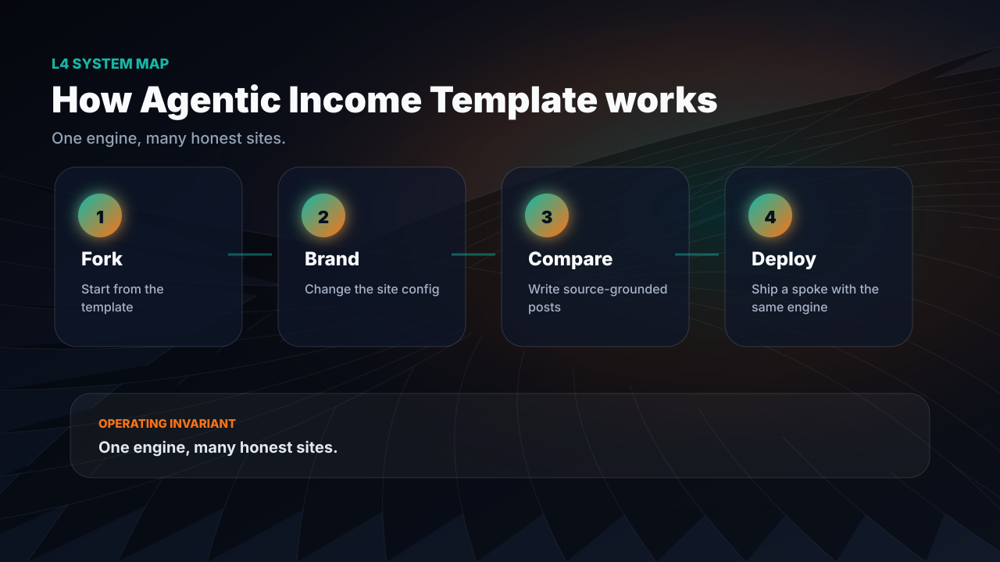
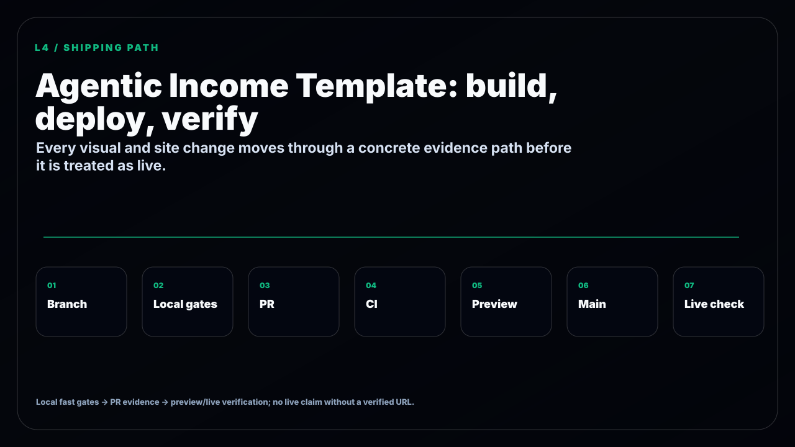

<!-- GITHUB_VISUALS_START -->
<p align="center">
  
</p>

<details open>
<summary><strong>How this repo works</strong></summary>
<p align="center">
  
</p>
</details>

<details>
<summary><strong>Build, deploy, verify path</strong></summary>
<p align="center">
  
</p>
</details>

<!-- GITHUB_VISUALS_END -->

# Agentic Income Template

A clone-and-deploy starter for an honest AI-tool comparison site that earns recurring affiliate income. The exact shell behind the [agentic-income network](https://github.com/frankxai/affiliate-agent-skills) — genericized so you can make it yours in an afternoon.

**Free, MIT.** Read the full method in [`affiliate-agent-skills/BUSINESS.md`](https://github.com/frankxai/affiliate-agent-skills/blob/main/BUSINESS.md).

## What you get

- **Next.js 16 + Tailwind v4 + MDX**, static-prerendered, fast.
- The honest-comparison **post shape** AI search engines cite: answer box → sortable table → honest pick → FAQ + FAQPage JSON-LD → one disclosure.
- An **affiliate engine binding** (`lib/affiliate.ts`): `getLink(tool)` returns your link when you've joined a program, **plain text when you haven't — never a dead link**.
- One example post + home + start + blog index. Sitemap + robots included.

## Quick start

```bash
git clone https://github.com/frankxai/agentic-income-template my-income-site
cd my-income-site
pnpm install
pnpm dev
```

Then:

1. **Brand it** — edit `lib/site.ts` (the *only* brand-specific file): name, domain, tagline, nav, and your other sites in `network`.
2. **Write a post** — copy `app/blog/best-ai-writing-assistants/` to a new slug, write a real comparison, add it to `lib/posts.ts`.
3. **Turn on the money** — join a program from `data/programs.json`, set its `ourLink`, and every link + table CTA for that tool goes live at once.
4. **Deploy** — push to GitHub, import in Vercel. Done.

## The rules (they're what make it work)

1. Honest pick always wins — never let a commission override the truth.
2. Recurring > one-time — that's where passive income compounds.
3. Own the audience — keep the email capture.
4. One disclosure per page. Re-verify affiliate terms before relying on them.

## The catalog

`data/programs.json` is a starter catalog of AI-tool affiliate programs (commission, recurring terms, signup URLs). It's vendored from the open [`affiliate-agent-skills`](https://github.com/frankxai/affiliate-agent-skills) engine — clone that as a sibling and run `pnpm sync:catalog` to stay current, or just edit your copy.

---

Built with the `agentic-income` operating brain. Star the [engine](https://github.com/frankxai/affiliate-agent-skills) if this is useful.
